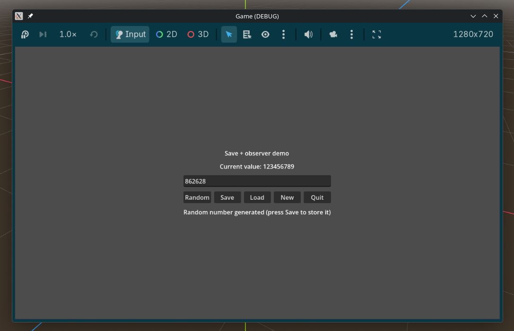

# Godot C# Modular Template

A starter for **Godot 4.6 + C# (.NET 8)** projects with a clean modular architecture.
Everything (engine, `.csproj`, solution, tests, formatting, `Nullable`) is already
set up — clone it, rename it, and start writing your own module instead of wrestling
with plumbing.

## Why use it

- 🚀 **Zero setup.** Engine, solution, tests, `Nullable` — preconfigured. Clone and build a feature.
- 🧩 **Modular.** One folder per feature; add or remove without touching the rest.
- 🧠 **Engine-free logic.** `Domain`/`Service` don't know Godot — test them without the editor.
- 🎛️ **UI as code.** Built in C#, not `.tscn` — clean git diffs and real code review.
- 💾 **Save system ready.** Main menu (Continue / New Game) + JSON saves written safely via a temp file, with a warning when a save fails; a new saved state is one line.
- 🖥️ **Settings.** Windowed / fullscreen (F11, Alt+Enter) and window resolution, kept in their own file.
- 🤖 **Built for AI agents.** `CLAUDE.md` + [skills](.claude/skills) so features land the same way every time.



## Stack
- Godot 4.6 (Mono / .NET)
- C# (.NET 8.0; Android builds target .NET 9.0)
- Nullable reference types enabled (`<Nullable>enable</Nullable>`)
- NUnit + Moq for tests (in [tests/Game.Tests](tests/Game.Tests))

## Running
1. Open `project.godot` in Godot 4.6 (the .NET build of the editor).
2. The editor imports assets and builds the C# on its own.
3. F5 — launches the main scene [level/game_level.tscn](level/game_level.tscn):
   the main menu (**Continue / New Game / Settings / Quit**). New Game opens the example screen — an
   input field and **Random / Save / Menu** buttons; Esc saves and returns to the menu.

Build/test from the console:
```bash
dotnet build Game.csproj      # build the game code
dotnet test Game.sln          # run the tests
```

## Architecture at a glance

The game is assembled from independent **feature modules** on a shared foundation,
and everything is wired in one place:

```
Level ─────► Modules ─────► Common
(assembles)  (use them)     (knows nobody)
```

- **Common** — reusable infrastructure (storage, ids, randomness, files, JSON).
- **Modules** (e.g. `Example`) — separate features, one folder each, with the layers
  `Domain / Service / UI / UI/Factory`.
- **Level** — the composition root: [GameLevel](src/Game/Level/GameLevel.cs) wires up
  services and screens by hand, and switching goes through observers (`ILevelObserver`).
  Modules exchange data only through interfaces that `Level` adapts.

## Documentation

Details live in READMEs next to the code:

- [src/Game/README.md](src/Game/README.md) — architecture overview, conventions, how
  to add a new feature. **Start here.**
- [src/Game/Common/README.md](src/Game/Common/README.md) — the infrastructure (foundation).
- [src/Game/Level/README.md](src/Game/Level/README.md) — game assembly and screen switching.
- [src/Game/Example/README.md](src/Game/Example/README.md) — the sample feature module.
- [src/Game/MainMenu/README.md](src/Game/MainMenu/README.md) — the start menu.
- [src/Game/Settings/README.md](src/Game/Settings/README.md) — player settings.

## Tests
Tests are in [tests/Game.Tests](tests/Game.Tests), a separate project referencing
`Game.csproj`. Example with mocks (Moq) of the file handler and the random generator:
[NoteServiceTests](tests/Game.Tests/Example/Service/NoteServiceTests.cs).
